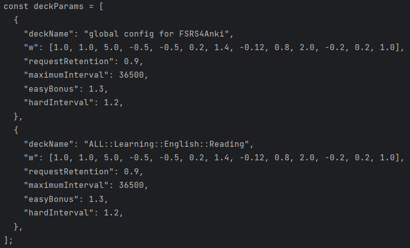

This reads a toml file and outputs the code to be pasted in the custom
scheduler field in Anki.

toml is a minimal configuration file format that is very readable
due to obvious semantics (https://toml.io/en/)

I noticed some quirks with toml, like all the elements should be 
float in the `w` parameter or it won't parse the config file.

### The input config file

### the output string

to use:  
`$ pip install toml`  
`$ python -m main`